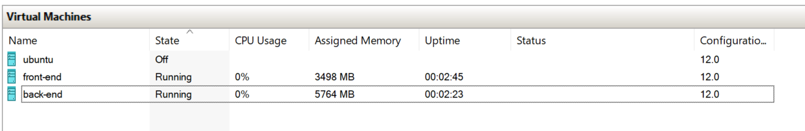
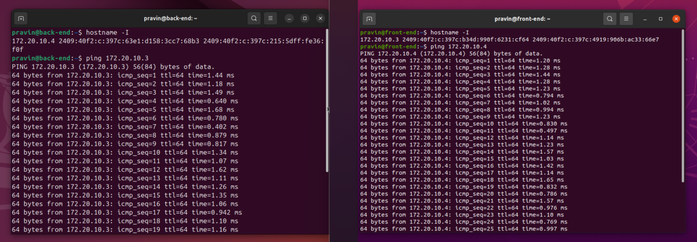
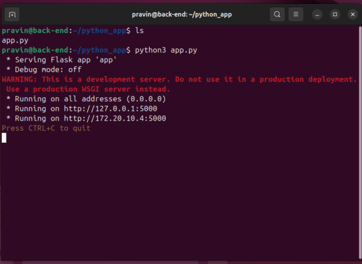
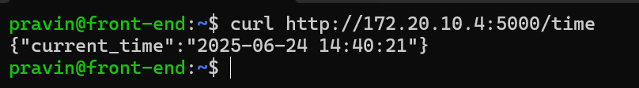
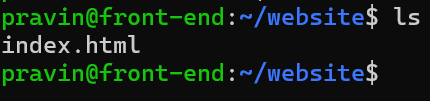
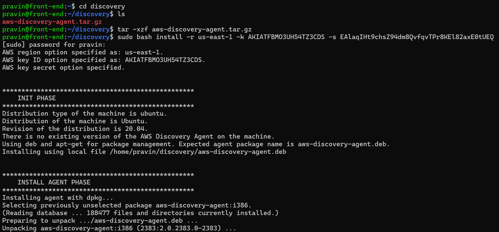
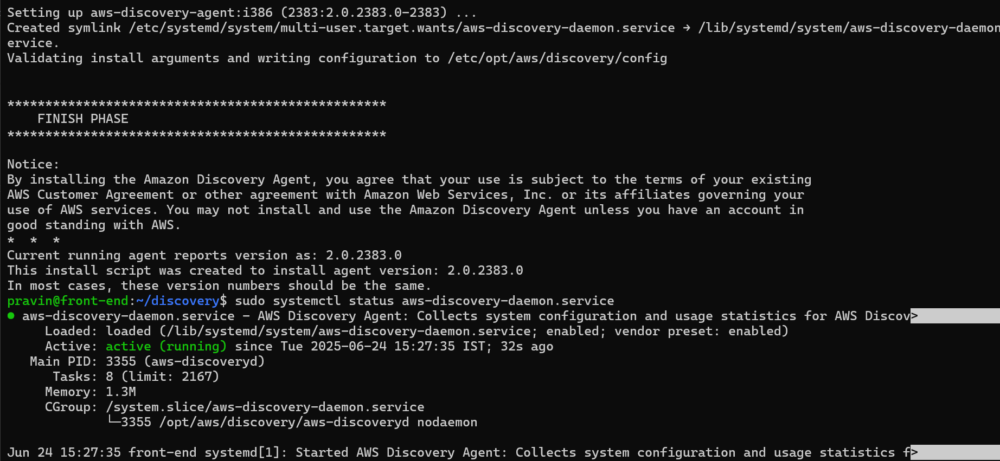
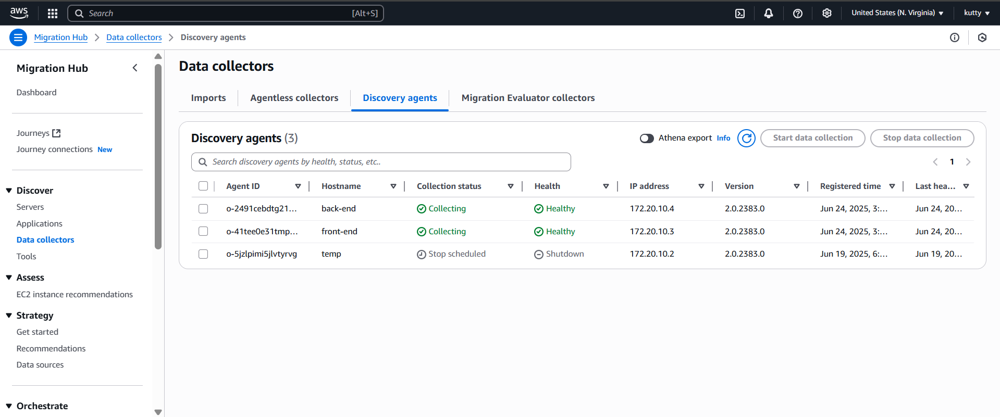
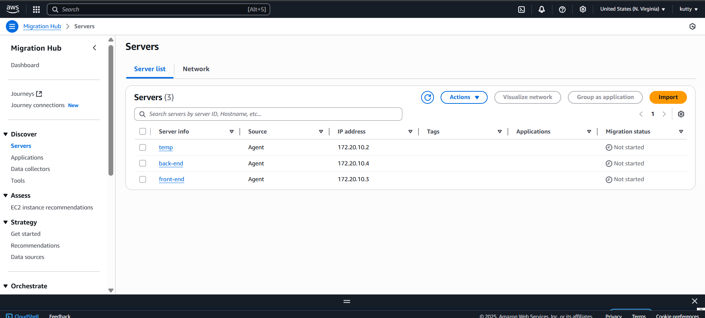
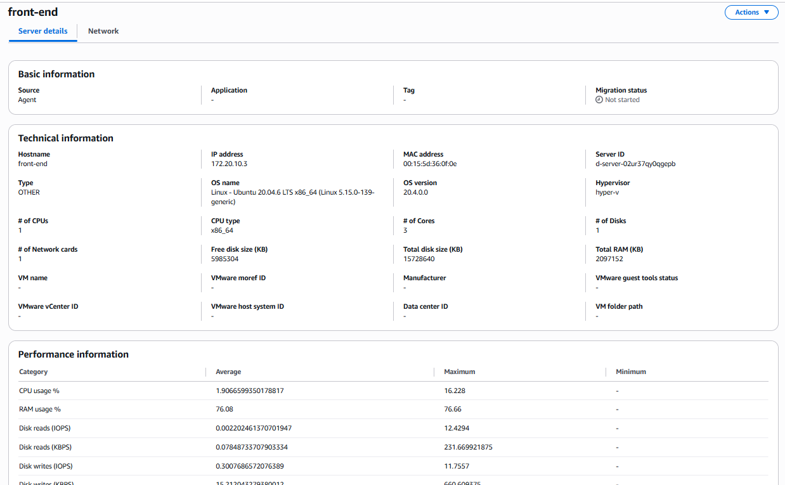

# AWS-Migration (On-Premises to cloud)

### 

1. **VM Creation**
2. **VM Discovery**
3. **Control Tower & Landing Zone Setup**
4. **Migration**
5. **Post-Migration checkup**


## VM creation

### **Description:**

In this setup, we will create two virtual machines (VMs) in windows hypervisor:

1.  One VM will host a simple frontend application.

2. The second VM will host the backend service.

We will first verify the connectivity between the two VMs to ensure that the frontend can communicate with the backend. Once this basic setup is confirmed, we will proceed to the discovery phase for further exploration and integration.





Both the VM's are able to communicate with each other.


#### **Back-End**

Now we will create application (API) using Python and Flask to make the webpage to display the time.


>
>
>Requirements: 
>
> - Language : Python 
>
> - Library : flask , flask_cors
>
>Create a folder python_app and paste this code in a py file name app.py and run it.

```sh
from flask import Flask, jsonify
from flask_cors import CORS
from datetime import datetime

app = Flask(__name__)
CORS(app)

@app.route('/time', methods=['GET'])
def get_time():
    now = datetime.now()
    current_time = now.strftime("%Y-%m-%d %H:%M:%S")
    return jsonify({"current_time": current_time})

if __name__ == '__main__':
    app.run(host='0.0.0.0', port=5000)
```


Flask application has started succesfully and running in

> http://172.20.10.4:5000

Check whether you can make request from the front-end to the application running in the back-end



#### **Front-End**

Now we will create a simple web-page to display the time and host that web page using python http server service.

>Create a folder website and paste this code in a html file named index.html.



```sh
<!DOCTYPE html>
<html>
<head>
  <title>Server Time</title>
  <script>
    async function fetchTime() {
      try {
        const response = await fetch("http://172.20.10.4:5000/time");
        const text = await response.text();
        document.getElementById("time").innerText = text;
      } catch (error) {
        document.getElementById("time").innerText = "Error fetching time";
      }
    }

    window.onload = fetchTime; // Fetch on initial load
  </script>
</head>
<body>
  <h1>Current Server Time</h1>
  <p id="time">Loading...</p>
  <button onclick="fetchTime()">Refresh Time</button>
</body>
</html>

```

Next open the html file and check whether the website is able to make the request to the api and display the time.

**VM Setup has been completed successfully**

## Discovery Phase 

### **Description:**

Since we have VMs to migrate, before proceeding with the migration, we need to perform a discovery of the VMs to estimate their resource usage. This will help in provisioning appropriate resources in the cloud.

To perform this task, we need to install the AWS Discovery Agent in your preferred region. For this scenario, we will be using the us-east-1 region.

> refer this link to download the agent
>https://docs.aws.amazon.com/application-discovery/latest/userguide/install.html#install_on_linux

### Create IAM User for Discovery Agent

Next, go to the IAM console and create a new user named discovery-user with the required permissions as shown below:


Once created, generate and securely save the Access Key ID and Secret Access Key — you’ll need them during the agent installation process.

### Installing and Running Discovery Agent

Now create a folder named discovery and place the discovery agent .gz file inside it. Then run the following commands to install the agent.

>Note: Use sudo su to switch to the root user before proceeding (this won't be visible in the image).

**To extract the disocvery agent file**

>tar -xzf aws-discovery-agent.tar.gz

**To install and start the discovery agent**

>bash install -r your-home-region -k aws-access-key-id -s aws-secret-access-key

**To check the status/restart/stop the agent**

>systemctl status/restart/stop aws-discovery-daemon.service





Do the same on the backend.

Now, if you go to the Migration Hub in AWS, you can see the discovery status:




Let the discovery to run for while (until you get the required information) and then stop the discovery from the VM's.

> Script to stop & disable the agent
> 1. sudo systemctl stop aws-discovery-daemon.service
> 2. udo systemctl disable aws-discovery-daemon.service

Go to Server section in migration hub and check the discovered data.




>Pending....

<h1 style="text-align: center;">நன்றி வணக்கம் 🙏</h1>


